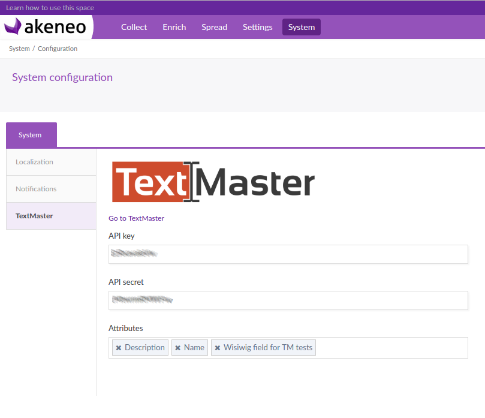

# Textmaster extension for Akeneo PIM

[](https://travis-ci.org/textmaster/akeneo-extension)

Also available on the Akeneo marketplace: https://marketplace.akeneo.com/

## Description

The Textmaster Akeneo extension allows you to easily translate your Akeneo product contents to a large quantity of languages with a simple mass edit process.

## Requirements

| Akeneo Textmaster extension | Akeneo PIM Community Edition |
|:---------------------------:|:----------------------------:|
| v2.1.*                      | v2.1.* + API template        |
| v2.0.*                      | v2.0.* + API template        |
| v1.3.*                      | v1.7.* + API template        |
| v1.2.*                      | v1.7.*                       |
| v1.1.*                      | v1.6.*                       |
| v1.0.*                      | v1.5.*                       |

You also need a Textmaster account to have some API credentials and access to the Textmaster's customer interface.

### Create a Textmaster account

Creating your account on https://textmaster.com is totally free. You can access the register form by clicking on the "Login" button or by following [this link](https://textmaster.com/sign_up).

### Create one or more API templates

The 2.1 version of this extension uses Textmaster API templates.
You must have at least one API template before using this extension.

## How it works


The translation request is done by a very simple mass edit process:

- Select your products in the grid and choose the "translate with Textmaster" mass edit operation.
- Choose the API template used for this translation project. [API templates are explained in this documentation](doc/resources/API_EN_v2.pdf)
- Send your products to Textmaster in just one click
- You can then connect to your Textmaster client interface to choose more options, like translation memory, preferred Textmasters, etc. Your products will be translated in the PIM as soon as they are in Textmaster

## Installation

First step is to require the sources:
```
composer require textmaster/akeneo-extension 2.1
```

Register your bundle in the `AppKernel::registerProjectBundles`:

```
new \Pim\Bundle\TextmasterBundle\PimTextmasterBundle(),
```

Then we need to add a new mass edit batch job:

```
bin/console akeneo:batch:create-job 'Textmaster Connector' 'textmaster_start_projects' "mass_edit" 'textmaster_start_projects'
```

Add the new routes used by the extension to the global router. Add the following lines at the end of `app/config/routing.yml`:

```
textmaster:
    resource: "@PimTextmasterBundle/Resources/config/routing.yml"
```

Update the database schema and regenerate your cache and assets:

```
rm bin/cache/* -rf
bin/console doctrine:schema:update --force
rm -rf web/bundles/* web/css/* web/js/* ; bin/console pim:install:assets
```

Finally, you must set a `cron` to retrieve the translated contents from Textmaster:
```
0 * * * * /home/akeno/pim/bin/console pim:textmaster:retrieve-translations >> /tmp/textmaster.log
```

This command checks for translated content once every hour. We do not recommend to check more often than every hour to not overload the Textmaster servers.

### Parameters

You can configure your TextMaster plugin in the dedicated screen: `System >> Configuration >> TextMaster`



In this screen you will be able to set:

- you API credentials : `API key` and `API secret`
- the attributes you want to translate

## Screenshots


## Video demo

A live demonstration for the 1.2 version of this extension is available on this short video:
https://www.youtube.com/watch?v=9WkyQFwoWWo
